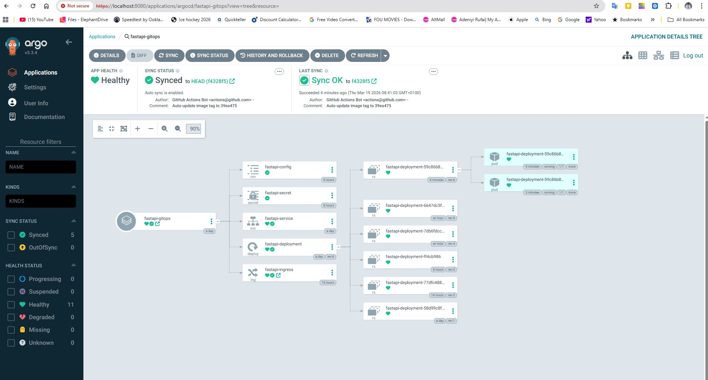
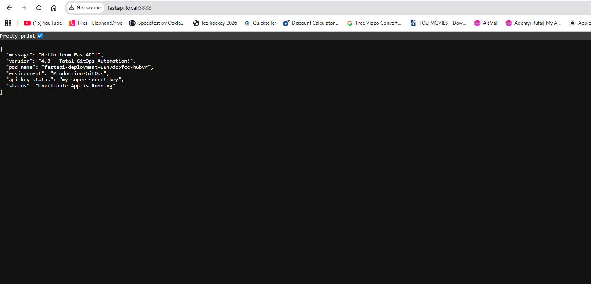

---
# Zero to GitOps: Deploying a FastAPI App with ArgoCD on Kubernetes

This repository documents my journey of building a local GitOps pipeline from scratch. It is designed as a step-by-step guide for beginners to understand how to containerize an application, deploy it to a local Kubernetes cluster, and manage it using ArgoCD.

---

## Prerequisites
Before starting, ensure you have the following installed on your machine (this guide uses Windows PowerShell):
* **[Docker Desktop](https://www.docker.com/products/docker-desktop/)** (Must be running)
* [Minikube](https://minikube.sigs.k8s.io/docs/start/)
* [kubectl](https://kubernetes.io/docs/tasks/tools/)
* [Git](https://git-scm.com/)
* [Python 3.x](https://www.python.org/downloads/)
* **A Code Editor** (like [VS Code](https://code.visualstudio.com/))
* Accounts on [GitHub](https://github.com/) and [Docker Hub](https://hub.docker.com/)

---

## Project Architecture & Directory Structure

To maintain a professional "Separation of Concerns" (a core DevOps principle), this architecture is split into two completely separate Git repositories: one for the developers, and one for the GitOps controller.

### 1. The Application Code Repository (`fastapi-app-code`)
This repository contains the application logic and the Continuous Integration (CI) automation.

```
fastapi-app-code/
├── .github/
│   └── workflows/
│       └── ci.yaml          # The GitHub Actions CI pipeline
├── main.py                  # The FastAPI Python application
├── requirements.txt         # Python dependencies
└── Dockerfile               # Instructions to build the container image
```

### 2. The GitOps Configuration Repository (`argocd-fastapi-config`)
This repository acts as the "Single Source of Truth" for our infrastructure. ArgoCD continuously monitors this repository and syncs the YAML manifests to the Kubernetes cluster.

```
argocd-fastapi-config/
├── configmap.yaml           # Plain text environment variables
├── deployment.yaml          # Defines the pods and pulls the Docker image
├── ingress.yaml             # External routing rules (fastapi.local)
├── sealedsecret.yaml        # Asymmetrically encrypted sensitive data
├── service.yaml             # Internal load balancer
└── README.md                # This documentation file
```

### 3. The Local (Your Computer) directory setup will look like this, where everything happens.

```
fastapi-project/
├── .github/
│   └── workflows/
│       └── ci.yaml
├── main.py
├── requirements.txt
├── Dockerfile
│
├── kubeseal.exe  # Don't push to GitHub as it remains in the local folder only 
├── kubeseal.tar.gz  # Don't push to GitHub as it remains in the local folder only 
│
├── argocd-fastapi-config/
│               ├──  configmap.yaml
│               ├──  deployment.yaml
│               ├──  ingress.yml
│               ├──  sealedsecret.yaml
│               ├──  service.yaml
│               └──  readme.md                
│
├── fastapi-app-code/               
│               ├── main.py
│               ├── Dockerfile
│               ├── requirements.txt
│               ├── readme.md
│               └── .github/
│                       └── workflows/
│                               └── ci.yaml
│
└── Readme.md
```
*(Note: The `kubeseal.exe` CLI tool is downloaded to this local folder to perform encryption, but it is explicitly kept out of version control and never pushed to GitHub).*

---

## Phase 1: Build and Containerize the Application
First, we created a simple Python FastAPI application that displays a welcome message and the name of the Kubernetes pod it is running on.

### 1. The Code (`main.py`) Based on the versions 1 - 4 and inclusion of updates and security implementation
```python
from fastapi import FastAPI
import os
import socket

app = FastAPI()

@app.get("/")
def read_root():
    hostname = socket.gethostname()
    return {
        "message": "Hello from FastAPI!",
        "pod_name": hostname,
        "status": "Unkillable App is Running"
    }
```
```python
from fastapi import FastAPI
import os
import socket

app = FastAPI()

@app.get("/")
def read_root():
    hostname = socket.gethostname()
    return {
        "message": "Hello from FastAPI!",
        "version": "2.0 - The Ingress Update",
        "pod_name": hostname,
        "status": "Unkillable App is Running"
    }
```

```python
from fastapi import FastAPI
import os
import socket

app = FastAPI()

@app.get("/")
def read_root():
    hostname = socket.gethostname()
    
    # Grab the variables from the Kubernetes environment
    environment = os.getenv("APP_ENVIRONMENT", "Unknown Environment")
    api_key = os.getenv("SECRET_API_KEY", "No Key Provided")

    return {
        "message": "Hello from FastAPI!",
        "version": "4.0 - Total GitOps Automation!",
        "pod_name": hostname,
        "environment": environment,
        "api_key_status": api_key, 
        "status": "Unkillable App is Running"
    }
```

### 2. Dependencies (`requirements.txt`)
```text
fastapi==0.104.1
uvicorn==0.24.0.post1
```

### 3. The Dockerfile
```dockerfile
# Use the official Python image
FROM python:3.10-slim

# Set the working directory inside the container
WORKDIR /app

# Copy the requirements file and install dependencies
COPY requirements.txt .
RUN pip install --no-cache-dir -r requirements.txt

# Copy the rest of your application code
COPY main.py .

# Expose the port FastAPI runs on
EXPOSE 8000

# Command to run the application
CMD ["uvicorn", "main:app", "--host", "0.0.0.0", "--port", "8000"]
```

### 4. Build and Push to Docker Hub
Open PowerShell and run:
```bash
docker login
docker build -t <your-dockerhub-username>/fastapi-app:v1 .
docker push <your-dockerhub-username>/fastapi-app:v1
```

---

## Phase 2: Create the GitOps Repository (This Repo)
ArgoCD requires a "Single Source of Truth." We created this Git repository to hold our Kubernetes manifests.

### 1. `deployment.yaml`
Tells Kubernetes to pull our Docker image and run 2 replicas.
```yaml
apiVersion: apps/v1
kind: Deployment
metadata:
  name: fastapi-deployment
  labels:
    app: fastapi
spec:
  replicas: 2
  selector:
    matchLabels:
      app: fastapi
  template:
    metadata:
      labels:
        app: fastapi
    spec:
      containers:
      - name: fastapi-container
        image: <your-dockerhub-username>/fastapi-app:v1
        ports:
        - containerPort: 8000
```

### 2. `service.yaml`
Creates a stable network connection (Load Balancer) to route traffic to the pods.
```yaml
apiVersion: v1
kind: Service
metadata:
  name: fastapi-service
spec:
  selector:
    app: fastapi
  ports:
    - protocol: TCP
      port: 80
      targetPort: 8000
  type: ClusterIP
```

*Push these files to your main GitHub branch.*

---

## Phase 3: Start Kubernetes & Install ArgoCD

### 1. Start the Local Cluster
```bash
minikube start
```


### 2. Install ArgoCD
```bash
kubectl create namespace argocd
kubectl apply -n argocd -f [https://raw.githubusercontent.com/argoproj/argo-cd/stable/manifests/install.yaml](https://raw.githubusercontent.com/argoproj/argo-cd/stable/manifests/install.yaml)

OR

**Use server-side apply below (this fixes annotation size issues):**
kubectl apply --server-side -n argocd -f https://raw.githubusercontent.com/argoproj/argo-cd/stable/manifests/install.yaml
```

```
Verify Pods and wait until all are Running
kubectl get pods -n argocd
```

### 3. Retrieve the ArgoCD Admin Password (Windows PowerShell)
```powershell
[System.Text.Encoding]::UTF8.GetString([System.Convert]::FromBase64String($(kubectl -n argocd get secret argocd-initial-admin-secret -o jsonpath="{.data.password}")))

OR

kubectl get secret argocd-initial-admin-secret -n argocd -o jsonpath="{.data.password}" | base64 -d
```

### 4. Access the Dashboard
```bash
kubectl port-forward svc/argocd-server -n argocd 8080:443
```
*Open `https://localhost:8080` in your browser. Log in with username `admin` and the password from the previous step.*


---

## Phase 4: Deploy the App via ArgoCD

In the ArgoCD UI, click **+ New App** and configure:
* **Application Name:** `fastapi-gitops`
* **Project Name:** `default`
* **SYNC POLICY:** `Automatic` (Check "Prune Resources" and "Self Heal")
* **Repository URL:** `https://github.com/<your-username>/argocd-fastapi-config.git`
* **Path:** `./`
* **Cluster URL:** `https://kubernetes.default.svc`
* **Namespace:** `default` *(Warning: Ensure there are no trailing spaces!)*

Click **Create**. ArgoCD will instantly sync your Git repo with your cluster.


---

## Phase 5: Access the App & Test GitOps

### Access the Webpage
Open a new PowerShell terminal and forward the traffic to your local machine:
```bash
kubectl port-forward svc/fastapi-service 8000:80
```
Visit `http://localhost:8000` in your browser!

### Testing the Magic of GitOps
1. **Self-Healing:** Run `kubectl delete pod <pod-name>`. Watch ArgoCD instantly detect the missing pod and spin up a replacement to maintain the desired state.


2. **Git as the Source of Truth:** Edit `deployment.yaml` in GitHub to change `replicas: 2` to `replicas: 4`. Commit the change. Watch ArgoCD automatically spin up two additional pods without touching the terminal!


---

## Common Troubleshooting (Lessons Learned)

**Error:** `transport: Error while dialing: dial tcp 10.111.16.119:8081: connect: connection refused`
* **Cause:** The `argocd-repo-server` pod crashed or failed to wake up after a machine sleep.
* **Fix:** Force Kubernetes to restart the pod: `kubectl rollout restart deployment argocd-repo-server -n argocd`

**Error:** `namespaces "default " not found`
* **Cause:** An invisible trailing space was accidentally typed in the Namespace field of the ArgoCD UI.
* **Fix:** Edit the app details in ArgoCD, remove the space so it says exactly `default`, and re-sync.

---
## Phase 6: Production Routing with Ingress (The Windows Workaround)

Relying on `kubectl port-forward` directly to a service is fragile; if a pod dies and restarts during an update, the tunnel collapses. In a production environment, we use an **Ingress** to permanently route traffic. 

Because Docker Desktop on Windows isolates network IPs, the standard `minikube tunnel` command often fails to bind to port 80. Here is how we built a production-grade Ingress and successfully bypassed the Windows network restrictions.

### 1. Enable the Ingress Controller
Minikube comes with an NGINX Ingress controller, but it must be enabled:
```bash
minikube addons enable ingress
````

*Verify it is running: `kubectl get pods -n ingress-nginx`*

### 2. Create the `ingress.yaml` Manifest

We created a new file in our Git repository to tell the NGINX controller how to route our traffic:

```yaml
apiVersion: networking.k8s.io/v1
kind: Ingress
metadata:
  name: fastapi-ingress
  annotations:
    nginx.ingress.kubernetes.io/rewrite-target: /
spec:
  rules:
  - host: fastapi.local
    http:
      paths:
      - path: /
        pathType: Prefix
        backend:
          service:
            name: fastapi-service
            port:
              number: 80
```

*We pushed this file to GitHub, and ArgoCD automatically deployed it to the cluster.*

### 3. The Windows DNS Hack (`hosts` file)

We needed to tell Windows that `fastapi.local` belongs to our local machine.

1.  Open **Notepad** as an Administrator.
2.  Open the file: `C:\Windows\System32\drivers\etc\hosts`
3.  Add this line to the very bottom:
    ```text
    127.0.0.1    fastapi.local
    ```
4.  Save and close.

### 4. The Port-Forward Bridge (The Workaround)

To bypass Windows blocking port 80, we forwarded the *entire NGINX Ingress Controller* to a custom port (`8888`) on our localhost.

Open a dedicated PowerShell terminal and leave this running:

```bash
kubectl port-forward -n ingress-nginx service/ingress-nginx-controller 8888:80
```

### 5. Access the Production URL

With the bridge open, we can now access the app via a clean domain name.
Open a browser and visit:
**`http://fastapi.local:8888`**

---
## Phase 7: Decoupling Configuration from Code (ConfigMaps & Secrets)

Hardcoding environment variables (like "Staging" or "Production") or sensitive data (like API keys and Database Passwords) directly into application code is a major security risk. In this phase, we updated the app to dynamically read these values using Kubernetes `ConfigMaps` and `Secrets`.

### 1. Update the Application (Version 3)
We updated our FastAPI `main.py` to pull variables from the system environment using Python's `os` module:

```python
from fastapi import FastAPI
import os
import socket

app = FastAPI()

@app.get("/")
def read_root():
    hostname = socket.gethostname()
    
    # Grab the variables from the Kubernetes environment
    environment = os.getenv("APP_ENVIRONMENT", "Unknown Environment")
    api_key = os.getenv("SECRET_API_KEY", "No Key Provided")

    return {
        "message": "Hello from FastAPI!",
        "version": "3.0 - The Config & Secrets Update",
        "pod_name": hostname,
        "environment": environment,
        "api_key_status": api_key, 
        "status": "Unkillable App is Running"
    }
````

*Built and pushed to Docker Hub as `<your-dockerhub-username>/fastapi-app:v3`.*

### 2. Create the Configuration Manifests

We created two new files in our Git repository to hold our variables.

**`configmap.yaml`** (For plain-text, non-sensitive data)

```
apiVersion: v1
kind: ConfigMap
metadata:
  name: fastapi-config
data:
  APP_ENVIRONMENT: "Production-GitOps"
```

**`secret.yaml`** (For sensitive data, encoded in Base64)

```yaml
apiVersion: v1
kind: Secret
metadata:
  name: fastapi-secret
type: Opaque
data:
  # Base64 encoded string for "my-super-secret-key"
  SECRET_API_KEY: "bXktc3VwZXItc2VjcmV0LWtleQ=="
```

### 3. Inject Variables into the Deployment

We updated our `deployment.yaml` to change the image tag to `v3` and map the ConfigMap and Secret into the container's environment:

```
      containers:
      - name: fastapi-container
        image: <your-dockerhub-username>/fastapi-app:v3
        ports:
        - containerPort: 8000
        env:
        - name: APP_ENVIRONMENT
          valueFrom:
            configMapKeyRef:
              name: fastapi-config
              key: APP_ENVIRONMENT
        - name: SECRET_API_KEY
          valueFrom:
            secretKeyRef:
              name: fastapi-secret
              key: SECRET_API_KEY
```

Once pushed to GitHub, ArgoCD automatically synced the new manifests, injected the variables, and performed a rolling update to Version 3.

---

### The GitOps "Secret Paradox" (Important Security Note)

While the setup above demonstrates how Kubernetes handles ConfigMaps and Secrets natively, **it exposes a massive security flaw in a GitOps workflow.**

Kubernetes Secrets are merely Base64 *encoded*, not encrypted. Anyone with access to this Git repository can easily decode `bXktc3VwZXItc2VjcmV0LWtleQ==` back into plain text.

**Real-World Production Solution:**
In a true production environment, you **never** commit raw `Secret` manifests to Git. Instead, DevOps engineers use tools like:

1.  **Sealed Secrets (Bitnami):** Asymmetrically encrypts the secret on the developer's laptop before committing to Git. A controller inside the cluster decrypts it.
2.  **External Secrets Operator:** Integrates with enterprise vaults (like `AWS Secrets Manager or HashiCorp Vault`) to fetch secrets dynamically at runtime, keeping them completely out of version control.

---
## Phase 8: Total Automation (Connecting CI to CD)

Until this phase, we acted as the Continuous Integration (CI) server by manually building and pushing Docker images from our local machine. To achieve true DevOps automation, we decoupled our architecture into two repositories and built a GitHub Actions pipeline to handle the build and deployment process automatically.


### 1. Separation of Concerns (The Two-Repo Architecture)
Industry standard practice dictates keeping application code separate from infrastructure code:
* **App Repo (`fastapi-app-code`):** Contains the Python code and `Dockerfile`. Developers work here.
* **Config Repo [(`argocd-fastapi-config`)](https://github.com/neyo55/argocd-fastapi-config):** Contains the Kubernetes manifests (`deployment.yaml`, `ingress.yaml`, `configmap.yaml` and others). ArgoCD watches this repo.

### 2. The Required Security Tokens
To allow GitHub to build and deploy on our behalf, we provisioned three secrets in our App Repo Settings-Secrets and variables-Actions, then `New repository secret` to input the below and their values:

* `DOCKERHUB_USERNAME`: Our Docker Hub ID.
* `DOCKERHUB_TOKEN`: A Personal Access Token from Docker Hub to push images.
* `GITOPS_TOKEN`: A GitHub Personal Access Token (PAT) with `repo` scope, allowing the CI pipeline to commit changes to the separate Config Repo.

### 3. The GitHub Actions CI/CD Pipeline
We created a workflow file in the App Repo at `.github/workflows/ci.yaml`. 

This pipeline acts as a virtual assistant. Every time code is pushed to the `main` branch, it executes the following steps:

```
name: Build and Push Docker Image

on:
  push:
    branches:
      - main

jobs:
  build-and-push:
    runs-on: ubuntu-latest

    steps:
    - name: Checkout the Code
      uses: actions/checkout@v4

    - name: Login to Docker Hub
      uses: docker/login-action@v3
      with:
        username: ${{ secrets.DOCKERHUB_USERNAME }}
        password: ${{ secrets.DOCKERHUB_TOKEN }}

    - name: Generate a Unique Image Tag
      id: generate_tag
      # Uses the short Git commit SHA as the version tag (e.g., 7cec8e0)
      run: echo "sha_short=$(git rev-parse --short HEAD)" >> $GITHUB_OUTPUT

    - name: Build and Push to Docker Hub
      uses: docker/build-push-action@v5
      with:
        context: .
        push: true
        tags: |
          ${{ secrets.DOCKERHUB_USERNAME }}/fastapi-app:${{ steps.generate_tag.outputs.sha_short }}
          ${{ secrets.DOCKERHUB_USERNAME }}/fastapi-app:latest

    - name: Checkout the GitOps Config Repository
      uses: actions/checkout@v4
      with:
        repository: <your-username>/argocd-fastapi-config
        token: ${{ secrets.GITOPS_TOKEN }}
        path: gitops-repo

    - name: Update Kubernetes Manifest with new Image Tag
      run: |
        cd gitops-repo
        
        # Uses 'sed' (Stream Editor) to find and replace the old image tag with the new Git SHA
        sed -i "s|image: <your-dockerhub-username>/fastapi-app:.*|image: <your-dockerhub-username>/fastapi-app:${{ steps.generate_tag.outputs.sha_short }}|g" deployment.yaml
        
        # Configure Git bot identity
        git config user.name "GitHub Actions Bot"
        git config user.email "actions@github.com"
        
        # Commit and push the updated manifest back to GitHub
        git add deployment.yaml
        git commit -m "Auto-update image tag to ${{ steps.generate_tag.outputs.sha_short }}"
        git push origin main
````

#### *(Note: Replace `\<your-username\>` and `\<your-dockerhub-username\>` with your actual IDs.)*
---




### 4. The Final Automated Workflow

With this pipeline in place, the deployment process is completely hands-off:

1.  A developer pushes a code update to `fastapi-app-code`.
2.  GitHub Actions spins up, builds the image, and pushes it to Docker Hub tagged with the unique Git SHA.
3.  The pipeline uses the `GITOPS_TOKEN` to checkout `argocd-fastapi-config`, uses `sed` to update the `deployment.yaml` with the new tag, and pushes the change.
4.  ArgoCD detects the new commit in the Config Repo and automatically deploys the new version to the Minikube cluster.




-----

## Phase 9: DevSecOps and Sealed Secrets (Fixing the GitOps Security Flaw)

As noted in Phase 7, standard Kubernetes Secrets are only Base64 encoded. Committing them to a Git repository exposes sensitive data to anyone who can read the repository. To achieve true "zero-trust" GitOps, we implemented **Bitnami Sealed Secrets**.

Sealed Secrets uses asymmetric cryptography. A controller inside the Kubernetes cluster holds a Private Key, while developers use a Public Key to encrypt secrets locally. The resulting `SealedSecret` file is completely unreadable and safe to commit to Git. Once ArgoCD deploys it, the controller decrypts it inside the cluster and spawns a native Kubernetes Secret for the application to use.

### 1. Install the Sealed Secrets Controller (Cluster-Side)
We installed the Bitnami controller into our local Minikube cluster. This controller generates the cryptographic keys and handles the decryption.

```
kubectl apply -f [https://github.com/bitnami-labs/sealed-secrets/releases/download/v0.27.1/controller.yaml](https://github.com/bitnami-labs/sealed-secrets/releases/download/v0.27.1/controller.yaml)
````

*Verify the controller is running:*

```
kubectl get pods -n kube-system -l name=sealed-secrets-controller
```

### 2. Install the `kubeseal` CLI (Client-Side for Windows)

To perform the encryption on our local machine, we downloaded the `kubeseal` CLI tool.

Open PowerShell in the config repository (`argocd-fastapi-config`) and run:

```
# Download the Windows binary using this command on powershell
Invoke-WebRequest -Uri [https://github.com/bitnami-labs/sealed-secrets/releases/download/v0.27.1/kubeseal-0.27.1-windows-amd64.tar.gz](https://github.com/bitnami-labs/sealed-secrets/releases/download/v0.27.1/kubeseal-0.27.1-windows-amd64.tar.gz) -OutFile kubeseal.tar.gz

OR 

# Use this command on bash 
curl -L -o kubeseal.tar.gz https://github.com/bitnami-labs/sealed-secrets/releases/download/v0.27.1/kubeseal-0.27.1-windows-amd64.tar.gz

# Extract the executable
tar -xf kubeseal.tar.gz kubeseal.exe
```

### 3. Encrypt the Vulnerable Secret

With `kubeseal` installed, we fed our vulnerable `secret.yaml` into the tool to generate an encrypted `sealedsecret.yaml`.

*(Note: We used `cmd /c` because standard Windows PowerShell sometimes struggles with file redirection symbols).*

```powershell
cmd /c ".\kubeseal.exe -o yaml < secret.yaml > sealedsecret.yaml"
```

The resulting `sealedsecret.yaml` transformed our simple Base64 string into a massive block of cryptographic gibberish, mathematically impossible to crack without the cluster's Private Key.

### 4. Push to Git and Deploy via ArgoCD

We deleted the vulnerable file from our computer and pushed the new, secure encrypted file to our Git repository.

```bash
git rm secret.yaml
git add sealedsecret.yaml
git commit -m "DevSecOps: Replace raw Secret with Bitnami SealedSecret"
git push origin main
```

### 5. The Final Architecture

Once ArgoCD synced the new `SealedSecret` manifest to the cluster, the Bitnami controller instantly decrypted it and generated a standard Kubernetes Secret (represented by a padlock icon in the ArgoCD UI).

Our FastAPI application experienced zero downtime and continued reading the database password exactly as it did before, entirely unaware of the complex encryption happening behind the scenes. We successfully achieved production-grade GitOps security!


